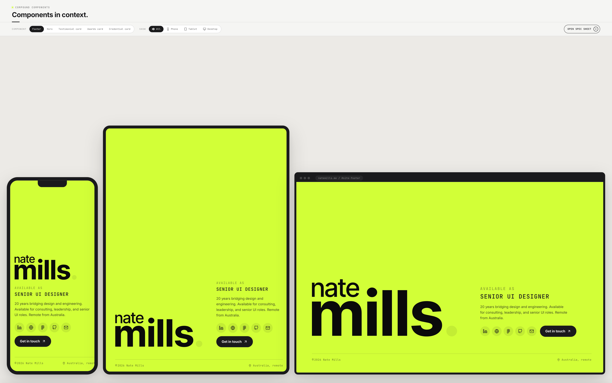
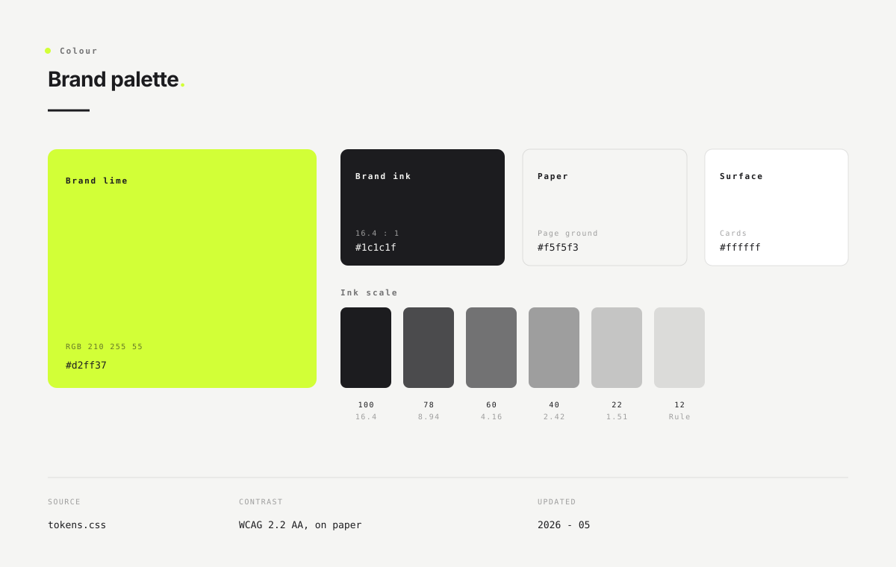
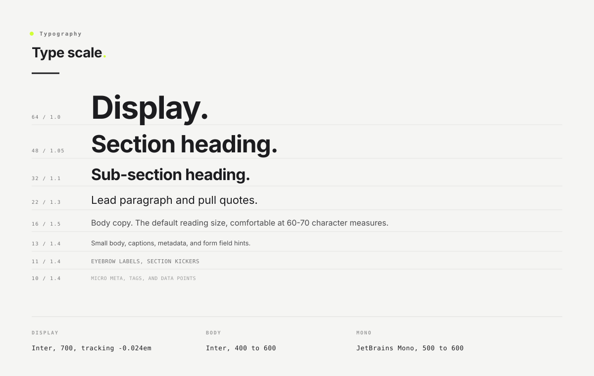

<div align="center">

# Nate Mills Design System

**Authored once as DTCG tokens, generated to CSS, audited to WCAG 2.2 AA.**

[](./LICENSE)
[](https://www.designtokens.org/)
[](https://www.w3.org/WAI/WCAG22/quickref/)
[](https://styledictionary.com)

[](https://nate-mills-portfolio.netlify.app/#uth-colour)
[](https://natemills.me)
[](https://bupa.natemills.me)
[](https://www.linkedin.com/in/millsdesign)



</div>

This is the real design system behind my portfolio, opened up so you can see how it is built, not just that it exists. It is small on purpose: one accent, a tuned neutral scale, two fonts, and a strict two-tier token model. Everything starts in one `tokens.json` file and propagates outward, so reskinning the brand is a one-line change and every component follows.

I publish it because the discipline is the point. A design system is easy to claim and hard to govern. This repo is the audit trail for the claims: the token source, the generated CSS, the component layer, and the written rules that keep them honest.

> **See it live.** The [under-the-hood design system](https://nate-mills-portfolio.netlify.app/#uth-colour) resolves every token in real time, in light and dark, section by section. This repo is the source it runs on.

## What's inside

Four files, and the discipline between them. That is the whole system.

- **`tokens.json`** : the single source of truth, in the [W3C Design Tokens Community Group](https://www.designtokens.org/) (DTCG) format. Two tiers: primitives (raw values) and semantics (roles).
- **`tokens.css`** : the generated CSS custom properties, built from `tokens.json` by [Style Dictionary](https://styledictionary.com). Never hand-edited.
- **`components.css`** : the component layer. Buttons, cards, chips, and the section heading pattern, each reading semantic tokens only.
- **[`design-system.md`](./design-system.md)** : the full write-up. Philosophy, the token model, the type and spacing scales, accessibility, contribution rules, and the content voice guide.

Prefer the guided tour to the raw source? The [live view](https://nate-mills-portfolio.netlify.app/#uth-colour) walks every section with the real values resolved.

## The model in one breath

```
PRIMITIVES   raw values, named by hue and stop      -->  e.g. --neutral-850: #1c1c1f
SEMANTICS    roles, reference primitives via var()   -->  e.g. --color-accent: var(--neutral-850)
COMPONENTS   classes that read semantics only        -->  e.g. .btn--primary { background: var(--brand-lime) }
```

One way, top to bottom: components read semantics, semantics read primitives, primitives are literals. Nothing reaches back up. So one edit at the top, a new brand hue, propagates through every semantic and component that uses it. No find-and-replace, no drift. That propagation is the whole point.

## Token preview

<div align="center">

<br><br>

</div>

## Accessibility is a constraint, not a feature

It is wired into the tokens, so you cannot opt out of it by accident:

- Every text token is contrast-checked for WCAG 2.2 AA against each surface it can land on. The ratios live in the `tokens.css` comments.
- Focus rings are never removed without a replacement.
- Touch targets clear 44 by 44 px.
- Every animation is gated behind `prefers-reduced-motion`, collapsed in one place, not per component.

There is one honest carveout. The brand lime is a background and accent only. It fails as foreground text on the light surface, roughly 1.3 to 1, so the system refuses to let you use it there and hands you a theme-aware token instead. The full reasoning is in [`design-system.md`](./design-system.md#10-accessibility).

## Use it

```bash
git clone https://github.com/n8mills-UI/nate-mills-design-system.git
```

Read [`design-system.md`](./design-system.md) for the why. Read `tokens.json` and `components.css` for the how. Fork it for another brand by changing `--green-500` and watching every consumer follow. That is the system working as designed.

## License

[MIT](./LICENSE). Use it, learn from it, build on it.

---

<div align="center">

Built by Nate Mills, Design Systems and Full-Stack Design.
[natemills.me](https://natemills.me) | [LinkedIn](https://www.linkedin.com/in/millsdesign)

</div>
